# 页面需求开发：

​           在财务核算系统-Confluence页面。根据产品经理需求开发页面接口。三个接口（查询、发起划扣、提交划扣）。


开发接口的标准流程其实先要在 “ RAP ” 上备注好接口的各项参数。但现在不这样做了！

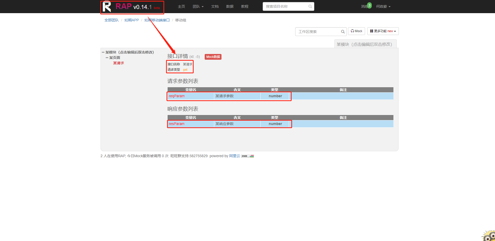


## 1、“查询”接口--流程一：定义参数

> ​        先不急着敲代码，先定义好接口中 “ 前端传给后台的请求数据 ” 、“ 后台传给前端的响应数据 ” 和 “接口路径名” （对，这些都是后台定义的）。然后发给前端，确认好，商量好。

01、第一个接口（查询）：如下图，“请求数据” 借鉴的是“财务管理后台系统” 页面的左侧菜单栏——“代收费用管理”。

​        “导出”接口一按就导出了，啥请求/响应参数都没有，怎么借鉴呢？Debug啊！直接从代码去看它的参数。（有时候Debug发现怎么不进去，可能是测试地址没设置！）

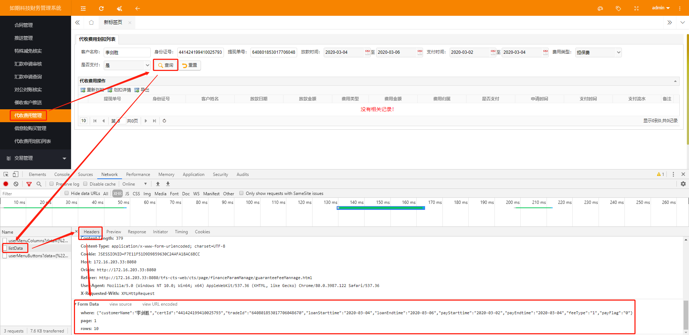

02、发现借鉴页面请求数据过长的，复制下来。粘贴到浏览器书签栏上的 “JSON在线| JSON格式化解析” 工具，点击 “校验 / 格式化 ” 按钮整理一下。这样看得清楚点。

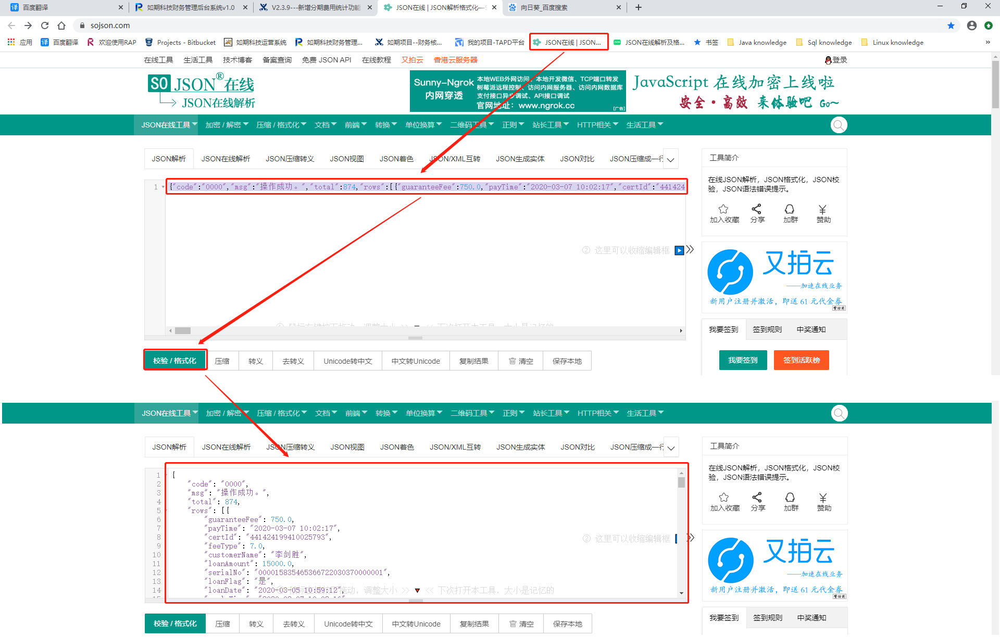


   03、复制整理好的借鉴页面请求数据，粘贴到 “Notepad+” 软件里。在这里就可以增减自己想要的数据。

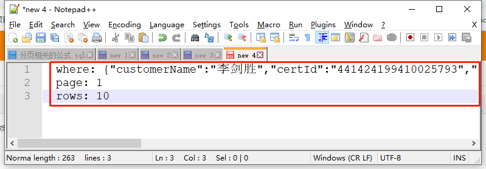

  04、如下图，看借鉴页面列表的菜单栏，对照上图发现众多参数都在参数 where 里面。page和rows参数分开。

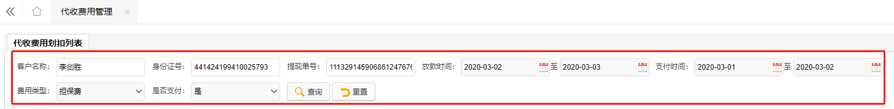

 05、根据借鉴接口路径找到所在的方法，看看方法括号里是不是这样传参数的。

```java
    //1.发现03图中的借鉴请求参数 where，在下面方法中是用注释@RequestParam绑定在方法参数上的。说明菜单栏上选择的参数都会进入到 where 里然后传给后台。
    @ResponseBody
    @RequestMapping("/listData")
    public String listDeductionFailCustomer(HttpServletRequest request, HttpServletResponse response,
                                            @RequestParam(value = "where", required = false) String where) {
        PageBean<Map<String, Object>> paramPageBean = new PageBean<>();
        List<Map<String, Object>> guaranteeFeeDeductionRecordList = new ArrayList<>();
        int total = 0;
        try {
            if(StringUtils.isNotEmpty(where)) {
                //2.从代码发现上图中的 page 和 rows 则是在 request 参数中。通过 Pagination（）构造方法生成对象，再来获取它们。（这样封装看似不如直接传来的简单，但肯定有它的理由。）
                Pagination pagination = new Pagination(request, null, null);
                String queryResult = guaranteeFeeDeductionAPIService.
                        queryGuaranteeFeeDeductionRecord(where, pagination.getOffset(), pagination.getLimit());
......
    //3.从代码发现的确需要传这些参数（定义请求/响应数据要配合代码来看！）。所以我们也可以模仿这种where请求参数格式。
    
```

06、如下图，回到需求页面。通过模仿上面的请求参数格式。可知，我们需求页面菜单栏上的参数也会进入到where里。page 和 rows 分开。

​        而上面借鉴页面菜单栏有很多参数，但我们只需要做需求页面菜单栏的参数（可以跟产品经理商量，哪些条件需要，哪些条件不需要），分别是  客户姓名 customerName，身份证号 certId，提现单号 tradeId    查询日期 loanStarttime  loanEndtime    费用类型 feeType 。

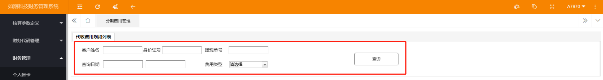

07、于是在 “Notepad+”里就可以修改请求数据(注意：1.确定好哪些是可选参数和必选参数。2.字段要加上注释。)。再发给前端确认。这步做完，请求数据格式已定义好！！

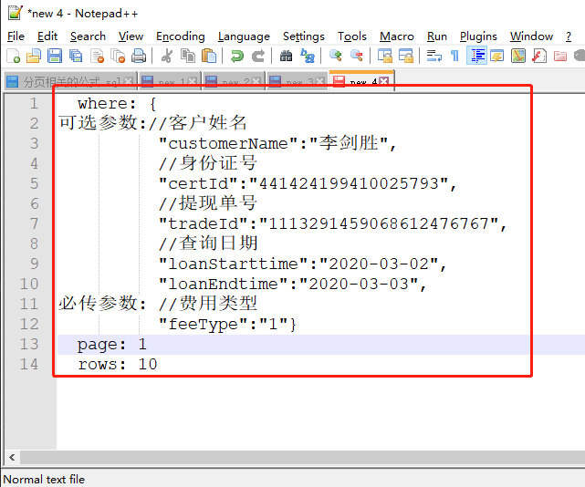

08、如下图, "响应数据"  借鉴！太长就复制粘贴到浏览器去整理。我们需要模仿这种响应数据格式。

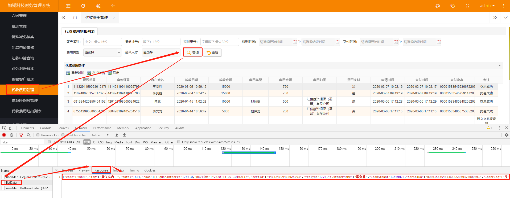

09、通过观察借鉴方法得知，响应参数是通过Dao层的Sql语句查出结果并在Service层组装好返回给Controller层，再传给前端的。所以我们也可以模仿这种响应格式！

​        首先要考虑下图需求页面 “响应数据字段” 和 “Dao层Sql语句查询字段” 之间的对应。分析列表左边1范围的字段可以在 “ 表app_customer_indentity_info和表app_acct_loan ”里获取。右边2范围的字段可以在 “ 表cts_extra_fee_stage_plan ”里获取。打开数据库查看2范围表里的字段跟需求页面的字段对比，哪些有，哪些没有。对比后跟产品经理商量就要剩下的字段。

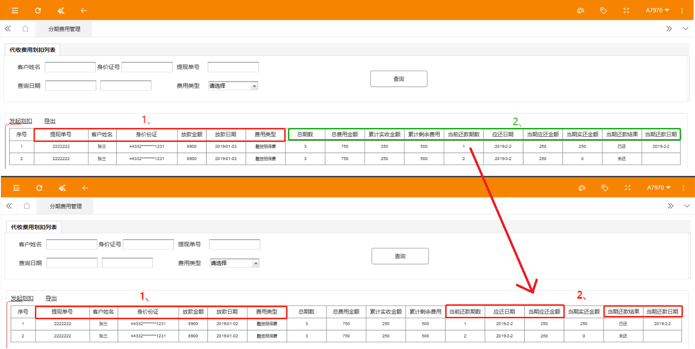

10、字段确定好了，开始写Sql语句。）在Navicat数据库软件上编写sql语句，把三张表融合在一起。随便拿一个提现单号来试试查不查得出数据。可以查出说明sql语句成功。

```sql
SELECT t2.coustomerId, t2.tradeId, t1.customerName, t1.certId, t2.originalBusinessSum, t2.businessDate,p.*
FROM app_customer_indentity_info t1 LEFT JOIN app_acct_loan t2 ON t1.customerId = t2.coustomerId
RIGHT JOIN  cts_extra_fee_stage_plan p on t2.tradeId = p.tradeId 
WHERE p.tradeId = '1114347295627494637318';
```

11、于是我们的响应参数也可以确定了。如下图。发给前端确认！

> 注意：
>
> 01、如字段有多个数字选项的表示意义也要发给前端。比如：status '状态  1-待扣; 2-已扣',
>
> 02、后面更改需求的时候，状态字段 status 传给了前端3个数字，1-代扣，2-已扣，3-停止收费 。要告诉前端status为2/3的时候不能划扣。因为前端要做判断语句参数，弹出窗口提示用户。）

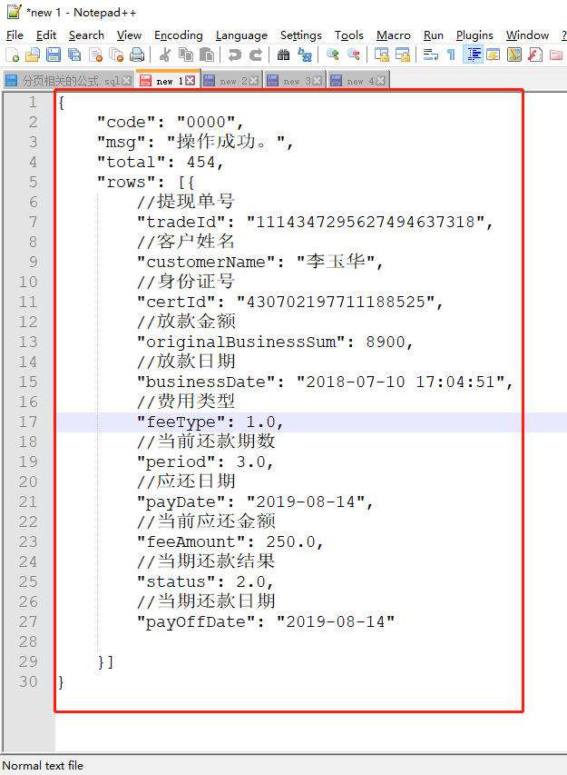

##### 定义参数——总结：

01、

> 1. 配合借鉴页面模仿请求/响应数据格式
> 2. 配合请求/响应数据，理顺借鉴页面方法代码。
> 3. 配合需求页面更改请求/响应数据字段。开始编写Sql语句。
> 4. 配合更改后的请求/响应数据，理顺需求页面代码。
> 5. 发给前端，完成请求数据/响应格式！

02、SpringMVC中，前台传json数组，后台怎么接受，然后解析成list呢？

​        表单的话，建议根据表单项封装一个参数实体类，每个字段对应表单的一项。 对于数组的话使用@RequestParam("gameIds[]")long[] gameIds，前台传参要达到和url中带参数gameIds[]=1&gameIds[]=2同样的效果。也可以不要中括号的，这个没有去尝试。 


03、json 转换怎么把集合变成数组然后发送给前端？例如渠道字段列表数据怎么变成数组（在F12中看到了response数据类型是数组）？（SpringMVC的json底层转换原理可以去浏览器书签上看看！）

​       不是变成数组，是后台转成json对象再转成string发给前台。 在前台里，如果把这个string直接写到js里，就是个json。 或者加个双引号，避免空字符串导致js错误，在用相关的js框架转。 如果是ajax方式，有的js的ajax框架支持直接转成json，不行的话依然用js框架转。 为啥像数组，可能是因为跟json的数据结构有关。 


## 2、“查询”接口--流程二：编写代码

#### Controller层：

01、如下图，代码可以就写在借鉴类下。

分支要选对（1、选分支前要去sourceTree " 获取-->拉取 “ 最新代码，然后在idea中右上角点点刷新！

​                      2、还要启动服务看看，能不能起得来）。

然后开始编写代码！

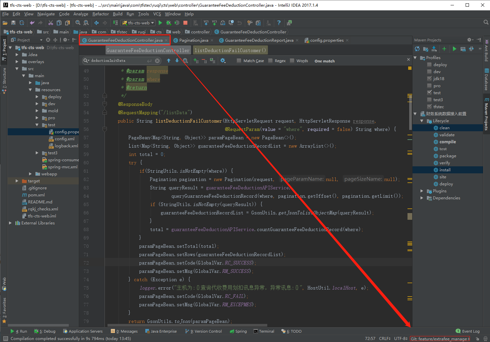

```java
    /**  01、写好注释，养成习惯。
     * 分期费用管理
     * @param where
     * @param request
     * @param response
     * @return
     */
//02、确定方法路径名为：最顶上类名注解后的路径名+新接口注解后的路径名（不要把方法名写进去了） /guarantee/installment ，发给前端。（标明好接口名字，“查询”还是“发起划扣”）。
    @ResponseBody
    @RequestMapping("/installment")
    public String installManagement( @RequestParam(value="where", required= true)String where,
                                     HttpServletRequest request,HttpServletResponse response){
        ......
            //03、看一遍借鉴方法的代码，理解得差不多，就照着敲！就是这两个方法名是需要另外取名字的。
                String queryResult = guaranteeFeeDeductionAPIService.queryInstallManagement(where,pagination.getOffset(),pagination.getLimit());
               ......
                total = guaranteeFeeDeductionAPIService.countInstallManagement(where);
            }
......
    }
```

#### Service层：

1、也写在借鉴接口类下，service层也把分支选好。开始编写代码！

```java
    /** 01、写好接口注释
     * 分期费用管理
     * @Author Hzh
     * @Date 2020/3/3
     * @Param  [param, offset, limit]
     * @return java.lang.String
     */
//02、看一遍借鉴方法的代码，理解得差不多，就照着敲！
    String queryInstallManagement(String param, int offset, int limit);

    int countInstallManagement(String param);
```

2、实现类，看一遍借鉴方法的代码，理解得差不多，就照着敲！

```java
    @Override
    public String queryInstallManagement(String param, int offset, int limit) {
......

    @Override
    public int countInstallManagement(String param) {
......
```

#### Dao层：

1、接口类，照着敲！

```java
    List<Map<String,Object>> queryInstallManagement(Map<String, Object> paramMap ,int offset, int limit);

    int countInstallManagement(Map<String,Object> param);
```

2、实现类要修改一下sql语句 

```java
@Override
public List<Map<String, Object>> queryInstallManagement(Map<String, Object> paramMap, int offset, int limit) {
    StringBuilder sbSql = new StringBuilder();
    sbSql.append(" SELECT t2.coustomerId, t2.tradeId, t1.customerName, t1.certId, t2.originalBusinessSum, t2.businessDate,p.*" +
            " FROM app_customer_indentity_info t1 LEFT JOIN app_acct_loan t2 ON t1.customerId = t2.coustomerId" +
            " RIGHT JOIN  cts_extra_fee_stage_plan p on t2.tradeId = p.tradeId ");
    sbSql.append(" WHERE 1=1 ");
    this.installManagementQueryCondition(sbSql,paramMap);
    return handleCtsDao.findPagingQueryResultBySql(sbSql.toString(),paramMap,offset,limit);
}

@Override
public int countInstallManagement(Map<String, Object> param) {
    //注意：01、请求参数都在sql语句尾部，响应参数都在sql语句头部，一个一个字段对应好，别漏了。
    //      02、每sql语句后面用加号 “+” 连接的时候别忘了还有英文模式下的一个逗号 “,” 除非下一句是from和where，就不用加逗号。
    StringBuilder sbSql = new StringBuilder(" select ");
    sbSql.append(" count(t2.tradeId) count FROM app_customer_indentity_info t1 LEFT JOIN app_acct_loan t2 ON t1.customerId = t2.coustomerId" +
            " RIGHT JOIN  cts_extra_fee_stage_plan p on t2.tradeId = p.tradeId ");
    sbSql.append(" WHERE 1=1 ");
    this.installManagementQueryCondition(sbSql,param);
    Map<String,Object> result = handleCtsDao.findUniqueMap(sbSql.toString(),param);
    return StringUtils.isEmpty(result) ? 0 : MapUtil.getIntValue(result,"count");
}

   private void installManagementQueryCondition(StringBuilder sb, Map<String, Object> param) {
 .......
     
            String customerName = MapUtil.getString(param,"customerName");
            if (StringUtils.isNotEmpty(customerName)){
                sb.append(" and t1.customerName =:customerName ");
            }

            String certId = MapUtil.getString(param,"certId");
            if (StringUtils.isNotEmpty(certId)) {
                sb.append(" and t1.certId = :certId ");
            }

            String tradeId = MapUtil.getString(param,"tradeId");
            if (StringUtils.isNotEmpty(tradeId)){
                sb.append(" and p.tradeId =:tradeId ");
            }

            String feeType = MapUtil.getString(param, "feeType");
            if (StringUtils.isNotEmpty(feeType)) {
                sb.append(" and p.feeType =:feeType ");
            }

            String period = MapUtil.getString(param,"period");
            if (StringUtils.isNotEmpty(period)){
                sb.append(" and p.period =:period ");
            }

            String status = MapUtil.getString(param,"status");
            if (StringUtils.isNotEmpty(status)){
                sb.append(" and p.status =:status ");
            }

            // 应还日期查詢--起始日期
            String payDateStart = MapUtil.getString(param, "payDateStarttime");
            if (StringUtils.isNotEmpty((payDateStart))) {
                sb.append(" and p.payDate >= :payDateStarttime ");
            }

            // 应还日期查询--結束日期
            String payDateEnd = MapUtil.getString(param, "payDateEndtime");
            if (StringUtils.isNotEmpty((payDateEnd))) {
                sb.append(" and p.payDate <= :payDateEndtime ");
            }
             //实还日期查询--起始日期
             String payOffDateStart = MapUtil.getString(param,"payOffDateStarttime");
             if (StringUtils.isNotEmpty(payOffDateStart)){
                 sb.append(" and p.payOffDate >= :payOffDateStarttime ");
             }

             //实还日期查询--结束日期
              String payOffDateEnd = MapUtil.getString(param,"payOffDateEndtime");
              if (StringUtils.isNotEmpty(payOffDateEnd)){
                  sb.append(" and p.payOffDate <= :payOffDateEndtime ");
    }
```

## 2.01、Dao层再开发——添加字段：

1、在原来sql语句基础上添加字段。

```sql
SELECT 
t1.tradeId AS tradeId, t2.businessDate AS businessDate,
/* 用此方法可以对名字和身份证号脱敏，很强！ */
CONCAT(LEFT(t3.customerName, 1), '**') AS customerName,
CONCAT(LEFT(t3.certId,4), '****' ,RIGHT(t3.certId,4)) AS certId,
t2.originalBusinessSum AS originalBusinessSum,
t1.feeType AS feeType,
/* 总期数，总费用金额。*/
(SELECT count(period) from cts_extra_fee_stage_plan where tradeId = t1.tradeId) AS totalPeriod,
(SELECT SUM(feeAmount) from cts_extra_fee_stage_plan WHERE tradeId = t1.tradeId) AS totalMoney,

/*累计实收金额 ： tradeId获得所属订单范围，status为2获得“已扣”范围，用小于等于号获得累计金额范围。*/
(SELECT SUM(feeAmount) from cts_extra_fee_stage_plan where tradeId = t1.tradeId AND `status` = 2 and period <= t1.period ) AS sumReceivedAmount,
/*累计剩余金额 ： 直接用总金额减去实收金额，得到剩余金额。sql语句可以直接加减乘除！
有时可能会报SQL异常：more than one row，超过了一行。就需要在sql语句后面加上约束条件。如下，加上period = t1.period 约束当期期数范围。*/
(SELECT (totalMoney-sumReceivedAmount) from cts_extra_fee_stage_plan WHERE tradeId = t1.tradeId AND period = t1.period ) AS sumSurplusAmount,
t1.period AS period,
t1.payDate AS payDate,
t1.feeAmount AS feeAmount,

/*当前实还金额 ：实收金额可以根据表格本身的内容来编写sql语句，不用从外部去获得扣除的实际金额。编写思路要从数据库的表格里存有的数据出发。*/
(SELECT feeAmount from cts_extra_fee_stage_plan WHERE tradeId = t1.tradeId and `status` = 2 and period = t1.period) AS currentPaidAmount,
t1.status AS status,
t1.payOffDate AS payOffDate
FROM cts_extra_fee_stage_plan t1 LEFT JOIN app_acct_loan t2 ON t1.tradeId = t2.tradeId
LEFT JOIN app_customer_indentity_info t3 on t2.coustomerId = t3.customerId
WHERE 1=1;

t1.feeType = 1 
AND t1.`status` = 2
```

2、如果sql语句很长，可以加个final修饰的静态变量来表示！

```java
private final static String  AI_FOLLOW_MANAGEMENT_INFO = " orderId, operatingLabel, follow, mobile, userName, " +
            " score, breatheResults, term, label, recordpath, recordfile, createTime, modifyTime ";
```


## 3、“查询”接口--流程三：后端调试

01、写好业务层和数据层代码，要写测试类测试一下返回的数据是否正确！

02、如果debug调试的时候改动了java代码，可以直接按如下图的按键，就可以不用执行maven命令，也不用再重启服务器，直接可以在网页看结果即可！

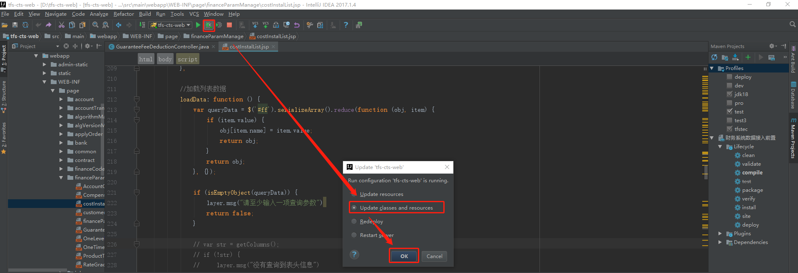

## 4、“查询”接口--流程四：前端调试

01、启动maven—deploy 命令上传到私服（将打包的文件发布到远程参考,提供其他人员进行下载依赖 ），再开启service服务。

02、如下图，把我的servcie组名发给前端，前端才能调用到我的service服务调试一下。

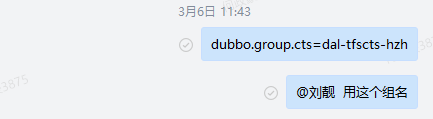

03、调试发现问题，可以用**Debug调试找出问题**。如果调试发现没问题，用**SourceTree提交**。第一个接口开发完毕！

> 01、接口开发好之后，Controller层里方法名是红色的。可能是sevice层的项目没有执行install命令——安装到本地。（将打包的jar/war文件复制到你的settings.xml文件中配置的本地仓库中(包括jar和pom),供其他模块使用 。）
>
> 02、web端deploy命令是有些问题。所以不用管，执行了打包命令就行。

04、“ 导出 ”接口路径名设置的跟借鉴方法路径名一样，所以一直报错 “ There is already 'guaranteeFeeDeductionController' bean method ” （有相同方法了）。无语！所以多看看报错信息，一般都明确指出来了。

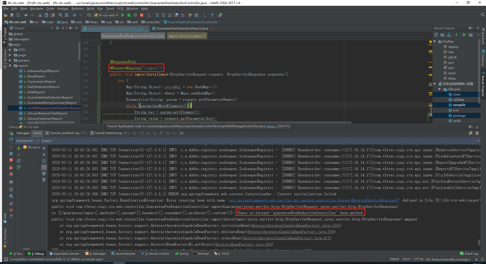

05、发现页面没出现左边的菜单栏，按Ctrl+F5刷新一下。

06、不同系统间，比如web和service是如何调用的呢？

​        因为在pom.xml文件中，web 添加了对service中 api 的依赖，当install安装到本地，就可以使用service中的方法了。或deploy上传到私服，其它电脑也可以调用了。


## 1、“发起划扣”接口--流程一：定义参数

01、如下图，借鉴页面的请求数据是：

tradeId: 1113291459068612476767 

feeType: 1

响应数据是：

{"msg":"操作成功。","code":"0000","data":"{\"feeAmount\":56.20,\"customerId\":\"55f7dede-735b-4f53-b6e7-9ae82951f3f6\",\"cerId\":\"430702197711188525\",\"loanDate\":\"2019-01-24 10:42:18\",\"feeTypeDes\":\"担保费\",\"deductionBankNo\":[{\"bankInfoValue\":\"中国农业银行_02_6228480109852379982\",\"bankInfoKey\":\"中国农业银行 6228***********9982\"}],\"deductionChannel\":[],\"feeType\":1,\"payStatus\":3,\"customerName\":\"陈建华\",\"loanAmount\":5000.00,\"tradeId\":\"1114347295627494637318\"}"}

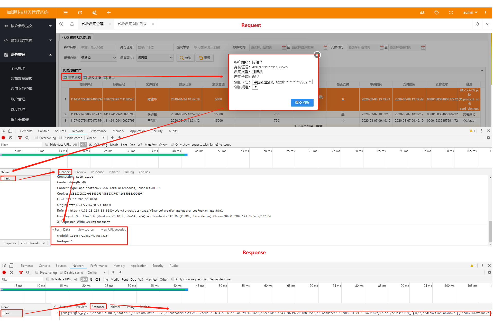

02、根据借鉴路径找到接口。看代码理解是传入tradeId、feeType参数。只返回银行卡号。弹出窗口里的其它字段数据，前端都可以从第一个接口处拿到。

03、如下图，确认传入的请求数据没错，是两个参数。但响应数据借鉴页面多了个渠道字段，后一张需求页面图却没有渠道字段，而且借鉴方法代码里有返回渠道数据。所以跟前端沟通后想在需求页面加上渠道字段，不然怕代码出错。看了借鉴方法代码，渠道字段数据会在这 “发起划扣” 接口返回给她。之后再写代码的时候可以加上获取渠道的代码。

​         所以修改后的响应数据是银行卡号和划扣渠道。  发给前端，请求/响应数据定义完毕！

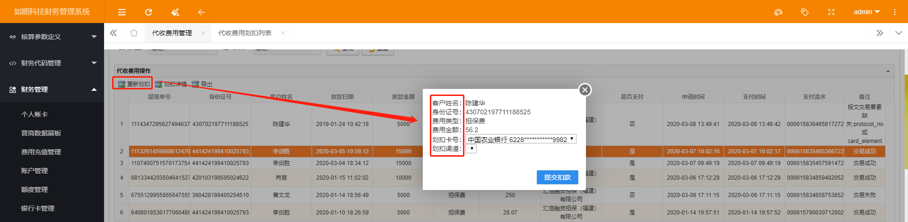

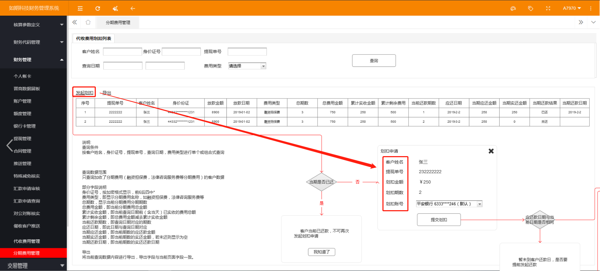

04、本来以为没有问题，但是文斌哥优化了一下。

​        如上图，需求页面请求数据只需要传入一个customerId就可以得到响应数据银行卡号。渠道不需要了。代码也要改一下，不能照搬了。要修改web方法参数，service方法里获取渠道代码不要。

​        所以修改后的请求数据只是customerId，响应数据是银行卡号。最后发给前端确认并沟通，customerId会在第一个接口通过响应数据返回给前端，作为隐藏域，不显示，划扣申请接口再传回来（看看第一个接口sql语句有没有customerId字段，没有就添加上，还好有！），数据定义完毕！

> ​    发起划扣接口老是显示400，请求参数失败。因为参数字段不一致。所以要注意字段customerId和字段coustermerId的细微区别，很容易就漏掉一个英文 “ O ” .

## 2、“发起划扣”接口--流程二：编写代码

#### Controller层：

01、确定路径名发给前端，修改方法参数。

```java
    @ResponseBody
    @RequestMapping("/deduction/installment")
    public String installmentDeduction(@RequestParam(value = "customerId",required = true) String customerId){
        try {
            String queryResult = guaranteeFeeDeductionAPIService.deductionInstallmentData(customerId);
......
```

#### Service层：

01、实现类。

```java
    @Override
    public String deductionInstallmentData(String customerId) {
        try {
            /* 01、如何获取customerId的代码不要，其它字段前端可以去第一个接口获取，这里就不用再把这些数据查出来了，简化代码！
            Map<String,Object> guaranteeInstallmentRecord = guaranteeFeeDeductionDao.queryInstallmentDeductionRecord(tradeId,feeType);
            String customerId = MapUtil.getString(guaranteeInstallmentRecord,"customerId");*/

            //02、调取外部接口获取银行卡信息，遍历拼装，丢进集合返回！
            List<BankInfo> bankInfos = bankInfoService.findByCustomerId(customerId);
            List<Map<String,Object>> deductionBankNoList = new ArrayList<>();
            if (StringUtils.isNotEmpty(bankInfos)){
                for (BankInfo bankInfo : bankInfos) {
                    //03、信用卡过滤掉。可以作个判断，如银行卡Id号跟静态变量“BANKCARDTYPE_CREDIT_CARD 为 2” 一样，说明本次银行卡号是信用卡，则跳过本次循环。
 if(BankInfo.BANKCARDTYPE_CREDIT_CARD.equals(bankInfo.getBankCardId())){
                        continue;
                    }
                    Map<String,Object> deductionBankNo = Maps.newHashMap();
                    deductionBankNo.put("bankInfoKey",
                            bankInfo.getBankName() + " " +
                                    CommonUtils.idEncrypt(bankInfo.getBankCardId()));
                    deductionBankNo.put("bankInfoValue",
                            bankInfo.getBankName()+ "_" +
                                    bankInfo.getBankCardId() + "_" +
                                    bankInfo.getCustomerBankCode() + "_" +
                                    bankInfo.getPhone());
                    deductionBankNoList.add(deductionBankNo);
                }
            }
            
         /*/04、获取渠道代码不要   
            String channelKey = "";
            //查询可用渠道
            if ("1".equals(feeType)){
                channelKey = CommonConstants.DEDUCTION_CHANNEL_KEY;
            .......  */
            
            return GsonUtils.toJson(deductionBankNoList);
        } catch (Exception e) {
            logger.error("发起分期费用划扣初始化数据发生异常，客户ID:{},异常讯息：{}", customerId, e);
        }
        return null;
    }
```

02、前端调试一下，没问题，即第二个接口开发完毕！


## 1、“划扣确认”接口--流程一：定义参数

01、如下图，需求页面的请求数据是：

​        tradeId: 1114347295627494637318

​        period: 1（修改了这一处地方：用期数period替代了渠道。）

​        deductionBankNo: 中国农业银行_6228480109852379982_02_13640006060

​        feeType: 1

响应数据是：

​        {"msg":"操作成功。","code":"0000"}

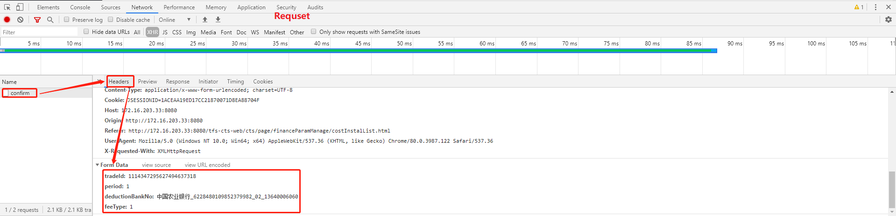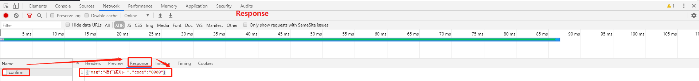

02、代码里也要修改，不能照搬。把方法参数改一改。确认划扣方法也要换，不能用借鉴网页的方法。借鉴网页的方法是统一划扣的，现在是分期划扣，所以要换。

​        确定请求数据是四个参数，响应参数是两个。发给前端确认，数据定义完成。


## 2、“划扣确认”接口--流程二：编写代码

#### Service层

01、控制层简单修改一个参数即可，其它照着敲！

```java
    @Override
    public String installmentConfirm(String param) {
        try {
            Map<String, Object> paramMap = GsonUtils.getJsonToObjectMap(param);
            String deductionBankNo = MapUtil.getString(paramMap,"deductionBankNo");
            //02、增添语句，这里还可以优化一下。
            BankInfo bankInfo = new BankInfo();
            if (StringUtils.isNotEmpty(deductionBankNo)) {
                String[] bankInfoArr = deductionBankNo.split("_");
                if (bankInfoArr.length >= 4) {
                    bankInfo.setBankName(bankInfoArr[0]);
                    bankInfo.setBankCardId(bankInfoArr[1]);
                    bankInfo.setCustomerBankCode(bankInfoArr[2]);
                    bankInfo.setPhone(bankInfoArr[3]);
                }
            }
            //03、增添语句。
            String feeType = MapUtil.getString(paramMap,"feeType");
            String tradeId = MapUtil.getString(paramMap,"tradeId");
            String period = MapUtil.getString(paramMap, "period");

            //04、增添语句，调用新方法。从“扩展分期计划表cts_extra_fee_stage_plan ”获取扩展费分期计划表数据。
            ExtraFeePlan extraFeePlan = extraFeeService.querySingletonExtraFeePlan(tradeId, feeType, period);

            //05、增添语句，调用外部接口判断划扣成功与否。并在记录表里记录数据。
            extraFeeService.deductionSingleExtraFee(extraFeePlan, bankInfo);
            
            /*01、借鉴网页的代码不要，借鉴网页的代码是统一划扣的，不是分期的，所以不要。
            Map<String, Object> historyDeductionRecord = guaranteeFeeDeductionDao.queryInstallmentDeductionRecord(tradeId,feeType);

            String customerId = MapUtil.getString(historyDeductionRecord,"customerId");
            // 放款金额
            String loanAmount = MapUtil.getString(historyDeductionRecord,"loanAmount");
            ......

            Map<String, Object> drawParam = Maps.newHashMap();
            drawParam.put("tradeId",tradeId);
            ......*/
            
            return GsonUtils.retJson(GlobalVar.RC_SUCCESS, GlobalVar.RM_SUCCESS);
        } catch (Exception e) {
            logger.error("重新发起担保费划扣，提交划扣确认时发生异常，提交参数：{}，异常讯息：{}",param,e);
            return null;
        }
    }
```

02、上面第五步调用此类 ExtraFeeServicelmpl.java 的方法如下：理解代码。

```java
   /**
     * 擴展費用單筆劃扣
     * @param extraFeePlan
     */
    //传入扩展费分期计划表数据、银行卡数据
    @Override
    public void deductionSingleExtraFee(ExtraFeePlan extraFeePlan, BankInfo bankInfo) {
        if (extraFeePlan == null) {
            return;
        }
        String tradeId = extraFeePlan.getTradeId();
        int feeType = extraFeePlan.getFeeType();
        try {
            //从“ 费用划扣记录表 fee_payment_record 、支付清单发盘表 payment_info_offer、 支付清单状态表 payment_info_status ”得出数据判断是否有正在划扣的、已划扣的、正常还款为回盘的。
            if (!this.isPay(extraFeePlan)) {
                return;
            }
            //创建 “支付报盘数据类” 对象。
            PaymentInfo paymentInfo = new PaymentInfo();
            paymentInfo.setTradeId(tradeId);
            paymentInfo.setFeeType(extraFeePlan.getFeeType() + "");
            //从 “ 支付清单发盘表 payment_info_offer ”获取已回盘，交易成功的提现数据。
            PaymentInfOffer putoutPaymentInfOffer = paymentInfoOfferDao.queryPutoutPaymentInfoOffer(tradeId);
            if (null == putoutPaymentInfOffer) {
                logger.warn("請求支付接口，未查詢到提現報盤數據，tradeId:{}, feeType:{}", tradeId, feeType);
                return;
            }
            //取出流水号再保存。
            paymentInfo.setOldOrderId(putoutPaymentInfOffer.getSerialno());

            String customerId = putoutPaymentInfOffer.getCustomerId();
            //从“ 支付清单发盘表 payment_info_offer” 获取订单号再保存订单号
            String serialNo = serialNoService.createSerialNo(SerialnoUtil.CTS_PAYMENT_INFO_OFFER);
            paymentInfo.setOrderId(serialNo);
            //保存商户号。  
            paymentInfo.setShopKeeperId(ctsSystemService.
                    findSystemValueCache(CustomizedPropertyConfigurer.PUTOUT_SHOPKEEPERID));
            //赋值并保存通道Id
            String channelId = null;
            if (CounterofferParam.FEE_TYPE_1.equals(extraFeePlan.getFeeType() + "")) {
                channelId = ctsSystemService.findValue(CommonConstants.DEDUCTION_CHANNEL_KEY);
            }
            if (CounterofferParam.FEE_TYPE_7.equals(extraFeePlan.getFeeType() + "")) {
                channelId = ctsSystemService.findValue(CommonConstants.DEDUCTION_CHANNEL_KEY);
            }

            paymentInfo.setChannelId(channelId);
            //从“ 借款客户身份信息表 app_customer_indentity_info ”获取信息数据。保存客户Id，保存客户名字，保存客户身份证。
            CustomerIndentity customerInfo = customerIndentityDao.queryByCustomerId(customerId);
            if (null != customerInfo) {
                paymentInfo.setCustomerId(customerId);
                paymentInfo.setCustomerName(customerInfo.getCustomerName());
                paymentInfo.setIdentityId(customerInfo.getCertId());
            }
            //取出签约版本号再保存。
            paymentInfo.setVersionNo(putoutPaymentInfOffer.getContractVersion());
            //根据用户ID 查询 默认还款卡或借款卡信息
            if (bankInfo == null) {
                bankInfo = bankInfoService.findUserDefaultPayment(customerId);
            }
           
            if (null != bankInfo) {
                paymentInfo.setBankName(bankInfo.getBankName());
                paymentInfo.setAccountNo(bankInfo.getBankCardId());
                paymentInfo.setBankNo(bankInfo.getCustomerBankCode());
                paymentInfo.setMobileNo(bankInfo.getPhone());
            }
            //调用方法从“ 提现合同信息表 app_putout_contract ”得到合同信息数据，保存合同编号
            //    从“ 合同表和冲账顺序明细关系表 cts_contract_debit_rule ”
            //    从“ 合同基础算法利率明细关联表 cts_contract_rate_extend ”
            //    从“ 合同表和扩展算法利率明细关系表 cts_contract_rate_detail ”
            PutoutContract activeContract = putoutContractService.findActivePutoutContract(tradeId);
            if (null != activeContract) {
                //保存书面合同
                paymentInfo.setPaperContractNo(activeContract.getAppContractNo());
            }

            // 调用方法，传入 扩展费分期计划表数据、已回盘，交易成功的提现数据、银行卡信息。 对“费用划扣记录表 fee_payment_record”执行插入操作，保存支付記錄
            this.buildAndSavePaymentRecord(extraFeePlan, putoutPaymentInfOffer, paymentInfo);

            // 调用外部接口，請求支付扣款
            TaskExecutor.execute(TaskThreadPool.getCachedThreadPool(), new PaymentTask(paymentInfo));
        } catch (Exception e) {
            logger.error("請求支付接口異常，tradeId:{}, feeType:{}, e", tradeId, feeType, e);
            return;
        }
    }
```

03、前端调试，若没问题，即第三个接口开发完毕！！


## 1、“导出”接口：编写代码

#### Controller层

01、略过前面几步，直接在web层敲代码！然后测试一下导出的Excel表格对不对。

```java
    @ResponseBody
    @RequestMapping("/install/import")
    public void importInstallment(HttpServletRequest request, HttpServletResponse response){
        try {
            //01、页面的表单项，可选条件参数丢进map中。Debug看到为null，说明没填。照着敲！
            Map<String,Object> paramMap = new HashMap<>();
            ......
                
            //02、调用service方法，返回列表数据。
            String result = guaranteeFeeDeductionAPIService.queryInstallManagement(paramStr,0,Integer.MAX_VALUE);
            //03、创建Bean文件 “ InstallManagementDeductionReport ”。
            //04、调用“ 接口帮助类 InterfaceResultHelper ”里的 transformation（）方法，将接口返回的JSON字符串，转换成对应的JavaBean。（代码细分下来就是：将接口返回的JSON字符串数据，赋值给变量code，msg，data。然后用 “接口返回值JavaBean类”的set（）方法存储。相当于封装在接口返回值类的对象里去了。）
            InterfaceResult<InstallManagementDeductionReport> interfaceResult = InterfaceResultHelper.transformation(result,null,null,null,InstallManagementDeductionReport.class);         
            List<InstallManagementDeductionReport> installManagementDeductionReports = new ArrayList<>();
            //05、调用obj2List（）方法，获取返回的data的数据列表。把data的数据用 parseArray（）方法转化为json集合类型数据再封装到集合对象去。
            if (interfaceResult.isSuccess(null)){
                installManagementDeductionReports = interfaceResult.obj2List(InstallManagementDeductionReport.class);
            }
            //06、调用export方法，导出excel表格。
            export(request,response,installManagementDeductionReports,"分期-代收费用划扣报表",InstallManagementDeductionReport.class);
        } catch (Exception e) {
            logger.error("导出分期-代收费用划扣讯息异常，异常原因：{}",e);
        }
    }
```

02、如下代码是上面第3步的实体类。

```java
public class InstallManagementDeductionReport {
    private String tradeId;

    private String certId;
    ......
       
//  实体类里写initmap（）方法的时候注意，用的是LinkedHashMap（）有序集合。所以用put（）方法添加元素的时候要一个一个跟上面成员变量对应好，输出数据的时候才不会有问题！
//  为什么实体类里要有initmap（）方法？因为后面代码里有用反射操作这实体类。
//  获取Class对象 ： 通过类名.class获取  Class clazz = Person.class；
//                                     clazz.newInstance() 会直接调用该类的无参构造函数进行实例化 
//  获取无参构造Constructor对象 ：       clazz.getConstructor()  返回值：Constructor 对象
//  获取无参的Method对象 ：              clazz.getMethod("方法名称")     返回值：Method对象
//  操作无参的Method对象 ：              Object method.invoke(实例对象)  如果有返回值，Object是方法的返回值

    public Map<String,String> initMap(){
        Map<String,String> map=new LinkedHashMap<String,String>();
        map.put("tradeId", ExcelDateFormat.getStringModel("提现单号"));
        map.put("certId", ExcelDateFormat.getStringModel("身份证号"));
        map.put("customerName", ExcelDateFormat.getStringModel("客户姓名"));
        map.put("businessDate", ExcelDateFormat.getStringModel("放款日期"));
        map.put("originalBusinessSum", ExcelDateFormat.getStringModel("放款金额"));
        map.put("feeType", ExcelDateFormat.getStringModel("费用类型"));
        map.put("totalPeriod",ExcelDateFormat.getStringModel("总期数"));
        map.put("totalMoney",ExcelDateFormat.getStringModel("总费用金额"));
        map.put("sumReceivedAmount",ExcelDateFormat.getStringModel("累计实收金额"));
        map.put("sumSurplusAmount",ExcelDateFormat.getStringModel("累计剩余金额"));
        map.put("period", ExcelDateFormat.getStringModel("当前还款期数"));
        map.put("payDate", ExcelDateFormat.getStringModel("应还日期"));
        map.put("feeAmount", ExcelDateFormat.getStringModel("当前应还金额"));
        map.put("currentPaidAmount",ExcelDateFormat.getStringModel("当期实还金额"));
        map.put("status", ExcelDateFormat.getStringModel("当前还款结果"));
        map.put("payOffDate", ExcelDateFormat.getStringModel("当期还款日期"));
        return map;
    }
     ......
         
    public String getFeeType() {
        return feeType;
    }
    //输出Excel表格里“费用类型”是一列 777777，有问题，需要更改变成中文。 于是在下面set（）方法里修改。
    //判断语句里我一开始用成了 “==” 等等于，它比较的是字符串地址值，所以不能用等等于！
    public void setFeeType(String feeType) {
        if (feeType.equals("1")){
            this.feeType = "担保费";
        }else {
            this.feeType = "法律服务费";
        }
    }
     ......
}
```


## 1、Bug - 开发问题：

01、问题背景： 如下图，“ 应还日期 ”和 “ 当期还款日期” 数据全都一样！

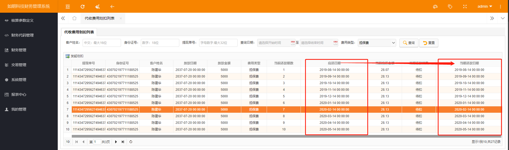

解： 1、流程是从后端返回列表数据，前端接收数据，再展现到页面上。所以先从后端sql字段先查起，

​               发现应还日期字段是 “payDate”，当期还款日期字段是 “ payOffDate”，后端sql语句头部字段没问题。

​               那就应该是前端获取日期字段错误了。如下图，果然是。

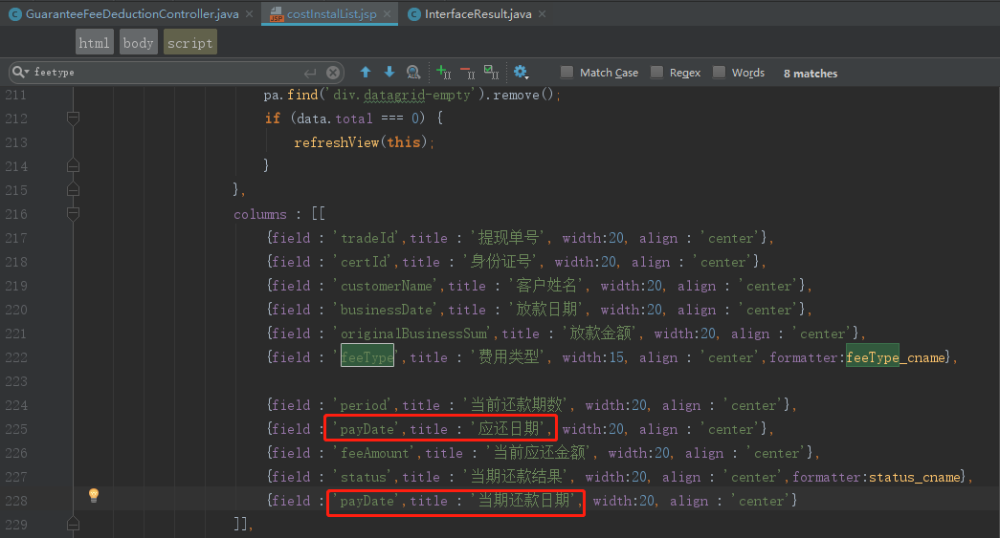

​         2、字段重复了所以导致获取日期数据重复。发给前端把 payDate 改为 payOffDate 即可！


02、问题背景：贷后发现问题，已经扣了两次担保费，但是分期页面却还是显示一次。

  解：可能是导出按钮和划扣确认接口没有加权限控制。叫前端妹子加上即可！


#### 使用PowerDesigner15_Evaluation工具 :

- 使用这个工具可以快速知晓各表格之间的关系.还可以快速生成SQL数据库代码.不用再自己写.自己想.参考  E:\da_y05\视频\other-pd工具使用.itcast.

#### 使用Microsoft Visio Premium 2010工具 :

- 遇到复杂逻辑的时候,可以用这工具把流程图先画出来. 再写代码. 不用光靠想,不然很容易混乱.


