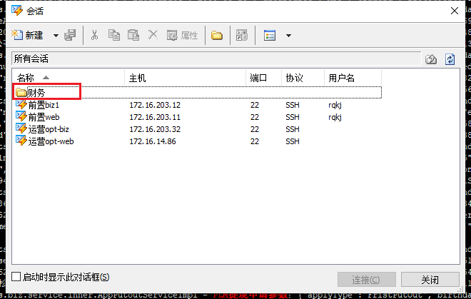
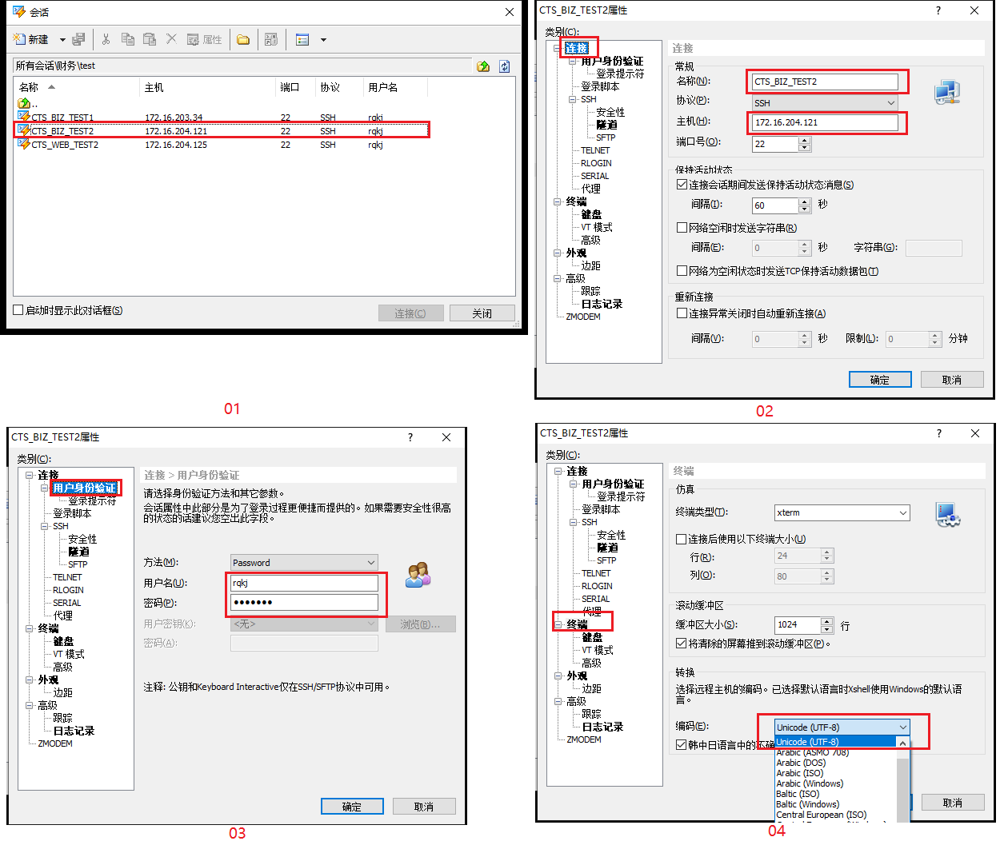

###### 1、问题背景： 

下图一是 “贷后数据小群” 反馈的问题图。发现此客户已还款。但是应还金额一项为零。这图一贷后页面跟我们图二财务后台页面数据是保持一致的。输入客户信息发现财务后台也不显示数据，为什么？


解：（ 思路：重点还是查看那四张表，放款表，还款计划表！）

1. 用客户名字去'' 如期放款表 '' 查询到提现单号 tradeId。

2. 再根据如下sql语句查找数据： 

   ```sql
   SELECT * FROM `acct_payment_schedule` WHERE putOutId = '6688365758900784363243';
   SELECT * FROM `jin_merchants_acct_loan` WHERE tradeId = '6688365758900784363243';
   SELECT * FROM `jin_merchants_payment_schedule` WHERE tradeId = '6688365758900784363243';
   ```

3.  一开始我发现 ''如期还款计划表''， ''晋商还款计划表 '' 的数据不同步。初步认定晋商还款计划表的数据没同步，怀疑财务后台可能是去如期还款计划表里查找数据的，导致页面不显示金额数据。

4. 去  ''晋商还款计划表 '' 查看 还款日期 字段“payTime” 为 “ 2019-12-27”，可是查看  到期日 字段 “psDueDt” 为 “2019-12-31”。 说明客户是提前还款。（注： 提前还款，如期还款计划表不做更新，到了还款日才同步数据。）

5. 那提前还的钱到哪去了？ 去 “如期放款表” 查看 预付款 字段 “prepayments” 为 “ 1345.97”. 说明去预付款了。

6. 去 ''晋商还款计划表 ''查看 “ 期供金额” 字段为 “1345.97 ”.说明这一期的钱刚好够扣款，只是提前还款。最后去 “贷后数据小群” 发原因信息即可！

   


###### 2、问题背景： 

​        去 ‘服务费用结算表’ 用sql语句  “SELECT * FROM cts_report_servfee_settl WHERE repayType = 1 AND repayStatus = 'FS' AND repayDate >= '2019-12-18';”  查询18号到现在的数据。

​	选择其中一条数据，然后去 ‘如期放款表 ’用sql语句  “ SELECT serialNo, tradeId, coustomerId, coustomerName, businessSum, originalBusinessSum, loanStatus, externalStatus, repayStatus  FROM app_acct_loan WHERE tradeId = '950305749346396327048'; ” 根据tradeId查出数据。看看字段“businessSum是否为0”和“repayStatus是否为2”，判断是否已结清。如果已结清。

​         再去 ‘推送前置系统记录表 ’ 用sql语句 “SELECT * FROM cts_send_record WHERE tradeId = '950305749346396327048' AND objectType = 3 ORDER BY createTime DESC LIMIT 0, 1;  ” 查出第一条最近的数据。看字段“content”里面的值“isSettled”是否为1.如果为1，说明已推送。但其它还有些数据没有推送到前置，要找出来。可是数据量有点大，有289条，如下图，怎么办？不可能一条条根据 tradeId 去调用方法推送。


解：（思路：可以查找出全部数据，然后循环遍历，每一条数据都会调用方法去判断是否已结清和已推送，没有结清就返回false。没有推送，则做推前置操作！我们可以自己新建一个Test测试类编写代码。）

> 想编写接口的测试类有个快捷键--Ctrl+Shift+T。
>
> 选中一个接口，按下快捷键出来一个界面。注意两个地方，setUp是初始化spring环境。下面的则是接口的方法，可以勾选决定要不要测试。点击OK则自动生成一个测试类。
>
> 可以看到左边的类名字有颜色，红色代表是我们自己生成的，蓝色则代表我们修改过。
>
> 
>
> 
>
> 

1. 养成好习惯，编写代码之前去SourceTree拉取一下最新代码，然后执行maven--clean命令。设置成生产环境--pro。
2. 我们在项目 tfs-cts-biz -->  src -->  test包下手动创建一个测试类。就不用自动生成了。取名BugHandle.java。

```java
public class BugHand {
    
    public static final Logger  logger = LoggerFactory.getLogger(BugHand.class);

    //5. 每个sql语句都对应一个DAO层。复制问题背景里的123条sql语句里的表格名，然后全局搜索。分别找到sql语句所在的DAO层类名。注入到这！注意注入的是接口名字。
    private IServfeeSettlReportDao  servfeeSettlReportDao;
    private IAcctLoanDao    acctLoanDao;
    private ISendRecordDao  sendRecordDao;
    private IMerchantsPaymentScheduleService merchantsPaymentScheduleService;

    //1.@Before的意思是.下面的方法执行之前，先执行before注释里的语句。（可以快捷键生成。）
    @Before
    public void setUp() throws Exception{
       //2.这行代码的意思是加载配置文件，先初始化spring启动环境。
       ApplicationContext ac = new ClassPathXmlApplicationContext("applicationContext.xml");
       //6.转变为实体类。（注意：注入的类名有时候跟bean包下的类名不一致。找到其它类中注入此类的注解注释。看看有没有写明它的真实类名！然后写入下面双引号处。）
       servfeeSettlReportDao = ac.getBean("IServfeeSettlReportDao",IServfeeSettlReportDao.class);
       acctLoanDao = ac.getBean("IAcctLoanDao",IAcctLoanDao.class);
       sendRecordDao = ac.getBean("ISendRecordDao",ISendRecordDao.class);
       merchantsPaymentScheduleService = ac.getBean("merchantsPaymentScheduleService",IMerchantsPaymentScheduleService.class);

    }

    //7.编写测试代码
    @Test
    public void execute() throws Exception {
        //7.01 spring下的断言工具类Assert ，判断注入都不为空。
        Assert.assertNotNull(servfeeSettlReportDao);
        Assert.assertNotNull(acctLoanDao);
        Assert.assertNotNull(sendRecordDao);
        Assert.assertNotNull(merchantsPaymentScheduleService);
        //7.02 获取第一个sql语句的数据.看看对应的Dao类下有没有 "查找数据" 方法。有就直接拿来用，没有就直接创建一个。
        List<Map<String, Object>> settlcusinfos = servfeeSettlReportDao.querySettlCusInfo();
        //7.03 使用工具类Assert判断两个值是否相等，不相等会抛出异常信息. 这一步是为了限制信息的数量。
        Assert.assertEquals(289,settlcusinfos == null ? 0 : settlcusinfos.size());
        //7.04 遍历集合
        for (Map<String, Object> settleCusInfo : settlcusinfos) {
            //7.05 获取tradeId，判断为空，则继续。因为可能费用结算表里没有数据，但是其它表里有。
            String tradeId = MapUtil.getString(settleCusInfo, "tradeId");
            if (StringUtils.isEmpty(tradeId)){
                continue;
            }
            //7.06 看第二个sql语句，只根据订单号获取如期放款数据的方法刚好有，直接拿来用。
            AcctLoan acctLoan = acctLoanDao.queryByPutOutId(tradeId);
            //7.07 调用方法判断，如果为空，则继续。因为可能如期放款表里没有数据，其它表里有。
            if (!vali1(acctLoan)){
                continue;
            }
            //7.08 看第三个sql语句，只根据订单号获取推送前置数据的方法没有，要去Dao类下创建新方法。创建好了，直接拿来用。
            Map<String, Object> sendRecord = sendRecordDao.queryLatelySendRecord(tradeId);
            //7.09 调用方法判断，如果为空，则继续。
            if (!vali2(sendRecord)){
                continue;
            }
            //7.10 设置输出日志等级，打印在控制台。并调用重新发送到前置方法。最后编译，测试！
            logger.info("tradeId:{}",tradeId,merchantsPaymentScheduleService.sendAgainRepayResult(tradeId));
        }
    }

    //3.编写判断方法，可以通过快捷键生成，但是带有@Test注释，我们把注释删掉并把public改为private私有。此方法要判断字段“businessSum为0” 和 “repayStatus 为2 ” 表示这客户已结清。
    //3.01 先明确参数：
    // 是谁要进来下面的方法？包含这两个字段的数据要进入方法。
    // 而这两个字段在问题背景第二条sql语句，用tradeId 查出的数据里。
    // 并且数据的接收类型是AcctLoan，所以我们参数类型是AcctLoan。
    //3.02 明确返回值：
    // 判断的返回值自然就是true和false，所以返回值是布尔值boolean.
    private boolean vali1(AcctLoan acctLoan) throws Exception {
        //3.03 获取字段，再判断字段businessSum 是否为空，是否等于0.（busineessSum是java.math包下的工具类。compareTo()跟equals()的区别是，前者不计较精度，两值相等。比如：2.0|2.00。而equals会返回false。）
        BigDecimal businessSum = acctLoan.getBusinessSum();
        if (businessSum == null || businessSum.compareTo(BigDecimal.ZERO) != 0){
            return false;
        }
        //3.04 获取字段，再判断字段repayStatus 是否为 2 .
        Integer repayStatus = acctLoan.getRepayStatus();
        if (repayStatus != 2){
            return false;
        }
        return true;
    }

    //4.编写判断方法。通过判断字段 “IsSettled”为1，表示这数据已推送.
    //4.01 谁要进去这方法？是第三个sql语句查询出来的数据.
    // 参数类型为Map.返回值为boolean.
    private boolean vali2(Map<String,Object> sendRecord) throws Exception {
        //4.02 判断进来的Map不为空。不然会报空指针异常。
        if (sendRecord == null){
            return false;
        }
        //4.03 获取content的值，判断是否为空。
        String content = MapUtil.getString(sendRecord, "content");
        if (content==null){
            return false;
        }
        //4.04 把content转为实体类对象，判断是否为空。
        RepayResult repayResult = GsonUtils.getJson(content, RepayResult.class);
        if(repayResult  == null ){
            return false;
        }
        //4.05 获取字段，再判断字段是否为空或为0.
        String settle = repayResult.getIsSettled();
        if (settle == null || settle.compareTo("0") == 0){
            return false;
        }
        return true;
    }
}
```

###### 3、问题背景

​	例一：贷后发来一份 tradeId 文件，已知上面的 tradeId 都是未推送到前置的。如下图，怎么做？


解：（思路：写一个测试类完成推送前置任务。先把这份文件保存在本地，编写代码用输入流读取这份文件，然后遍历，调用推送方法。）

```java
 //......(省略，跟上面一样！)    
  @Test
    public void execute() throws IOException {
        Assert.assertNotNull(servfeeSettlReportDao);
        Assert.assertNotNull(acctLoanDao);
        Assert.assertNotNull(sendRecordDao);
        Assert.assertNotNull(merchantsPaymentScheduleService);

        //1. 通过将给定的路径名字符串转换为抽象路径名来创建新的 File实例。
        File file = new File("E:/前置未结清明细.txt");
        //2. FileReader 创建一个新的 FileReader ，读取File对象。   BufferedReader(Reader in) 创建使用默认大小的输入缓冲区的缓冲字符输入流。
        BufferedReader reader = new BufferedReader(new FileReader(file));
        String tradeId = null;
        //3. （BufferedReader的方法 readLine() 读一行文字.） 循环遍历tradeId 并判断不为空，最
        while ((tradeId = reader.readLine()) != null) {
            //4. （String类里的方法 trim() 返回一个字符串，其值为此字符串，并删除任何前导和尾随空格。）tradeId 转变为字符串，最后调用推送前置方法，编译，运行，完成！
            logger.info("tradeId:{}", tradeId.trim(), merchantsPaymentScheduleService.sendAgainRepayResult(tradeId.trim()));
        }
    }
```


例二：晋商搞错了代偿还款数据，需要修改repayType为2，status为1.如果有很多，如何批量修改？


解：（思路：写一个测试类完成修改字段任务。先把这份文件保存在本地，编写代码用输入流读取这份文件，然后遍历，调用修改方法。）

```java
 //......(省略，跟上面一样！)      
   @Test
    public void execute() throws IOException {
   		//......

        File file = new File("E:/新建文本文档.txt");
        BufferedReader reader = new BufferedReader(new FileReader(file));
        String loanNo = null;
        while ( (loanNo = reader.readLine()) != null){
            //这里是调用了在同一个dao层的三个方法，（可以在同一个dao层，创建作用于不同表格的sql语句。）下面两个dao层的方法是自己创建的。（注意传入参数要用 hashmap装起来。）然后编译，运行即可！去数据库查看字段是否改变。
            MerchantsAcctLoan acctLoan = merchantsAcctLoanDao.getTradeId(loanNo.trim());
            int i = merchantsReportDao.updateRepayType(acctLoan.getTradeId());
            int i2 = merchantsReportDao.updateStatus(acctLoan.getTradeId());
            logger.info("loanNo:{}",loanNo.trim(),i,i2 );
        }

    }
```


###### 4、问题背景：

​	想熟悉业务流程细节，想去 debug 走一遍接口的代码。如何知道它所需的参数是哪些？

------

解：

​	1. 知道接口名字如何去找到它呢？如下图，财务业务流程里的 “提现申请” 接口 “apply”。


如果直接全局搜索”apply“，就会出来很多个，所以我们要往前一点，搜索他的接口类  ”IAppPutoutServcie“  就能找到它了。如下图。（老是说提供一个接口，其实它是接口类下的一个方法而已。）


2. 进去这接口里，找到info日志的关键字  “PLM提现申请参数”。一般接口都会有这些信息。如图：

   

3. 打开Xshell，准备连接财务后台服务器。

   01.点击 “打开” 出现如下图窗口，右键新建文件夹——取名 “财务”。方便管理。



​      02.财务文件夹里又新建三个子文件夹，对应开发，生产，测试。


​        03.我们这次去测试里找参数。所以在测试文件夹里点击 “ 新建” ，出来如下图窗口。注意名称要大写，加上测试环境，加上地址。这名称会显示在导航栏中，方便区分！输入主机地址。（ ip地址在桌面Excel文件 “第一、二、三套环境”里。 ）


​	04.还有一点注意，选择终端——编码选择UTF—8，防止乱码。然后选择ok。之后又会弹出输入用户名和输入密码窗口。（用户名密码在桌面Excel文件 “开发和测试机器” 里。）


​	  05.如下图，查看日志文件，每个公司的日志文件位置都不同。这里是进入  data文件。然后输入命令罗列出所有文件。


​           06.如下图，输入针对 “tomcat”的进程状态监控命令。发现出现了三个tomcat，第一个tomcat-org是运营的。第三个tomcat-ermas是贷后的。那就只能第二个是财务的了！


​            07.如下图，进入tomcat，罗列。进入webapps，罗列。最后输入打印日志命令。其中 “--color=auto”命令 是匹配字符串。限制日志输出范围。


​	    08.如下图，可以看到输出了很多条我们所需要的参数历史日志。选择最新的一组数据，复制。


​	    09.如下图，打开Json在线解析网页，把我们复制的参数数据解析出来。接口所需要的参数，查找完毕！！


###### 5、问题背景：

​	加密需求开发好了，如何把项目发布到测试环境 test2 ？

解：（思路：用maven命令创建war包，然后用Xshell和Xftp工具上传到远程服务器。）

	1. 如下图，用SourceTree，在“tfs-cts-service”项目中把 idea 当前分支变更为“tfs-cts-CustomerEncryption”，在idea里变更环境为“deploy”测试二。


​	2.去mian -- resources -- deploy -- config.properties文件里确认一下测试二地址是不是204.

​	3.调用maven打包命令，如下图，clean -- compile --  package。打包之前确保 “ config.properties ” 文件里的地址都改回来了，加上web共三处地方！


​	4.如下图，在taget目录下就已经有创建好的war包了。


​	5.打开Xshell，连接好测试二。

如下图，01：注意分好是业务层biz还是web层。02：填好名称和IP地址。03：填好账号和密码。在开发和测试机器excel文件里有。04：设置好UTF-8编码。




6.输入Linux命令。

```java
[rqkj@ctsbiz data]$ cd /data          //1、切换到根目录下的data文件夹处。
    
[rqkj@ctsbiz tomcat]$ cd tomcat       //2、切换到tomcat目录处。

[rqkj@ctsbiz tomcat]$ ps -ef|grep tomcat      //3、查看特定进程的状态（找到属于财务的tomcat程序ID）。也可用这个命令。“ ps aux|grep java ” ，ps aux是显示所有进程和其状态。
rqkj     17656  0.0  0.0 103320   848 pts/3    S+   10:34   0:00 grep java
rqkj     29768 73.8 79.8 7141628 3134296 ?     Sl   Feb24 14603:59 /usr/local/ava/jdk8/bin/java -Dnop -Djava.util.logging.manager=org......

[rqkj@ctsbiz tomcat]$ kill -9 28796           //4、输入Id，杀死财务tomcat进程，即关闭tomcat。
    
[rqkj@ctsbiz tomcat]$ ps -ef|grep tomcat      //5、再次查看进程状态，确保已被杀死！
rqkj     17680 17605  0 10:42 pts/3    00:00:00 grep tomcat

[rqkj@ctsbiz tomcat]$ cd webapps              //6、切换到webapps目录下。
[rqkj@ctsbiz webapps]$ ll                     //7、以列表形式列出当前tomcat目录里的所有文件。
total 70388
drwxr-xr-x 14 rqkj rqkj     4096 Nov  6  2017 docs
drwxr-xr-x  7 rqkj rqkj     4096 Nov  6  2017 examples
drwxr-xr-x  5 rqkj rqkj     4096 Nov  6  2017 host-manager
drwxr-xr-x  5 rqkj rqkj     4096 Nov  6  2017 manager
drwxr-xr-x  3 rqkj rqkj     4096 Nov  6  2017 ROOT
drwxrwxr-x  4 rqkj rqkj     4096 Feb 14 14:35 tfs-cts-biz
-rw-rw-r--  1 rqkj rqkj 72046025 Feb 14 14:23 tfs-cts-biz.war

[rqkj@ctsbiz webapps]$ rm -rf tfs-cts-web*          //8、删除tfs-cts-web和以tfs-cts-web为名的所有文件。这里把旧的war包删掉了，用Xftp软件去操作也是一样的。
```

7.点击菜单栏  ”文件传输“  按钮。


8.拷贝target下的war包，粘贴到webapps文件夹下。

> ​	tomcat是一个web应用的服务器，就是用来运行发布web应用项目的服务器。 tomcat下的webapps是用来存放运行工程的目录。**把程序包放在webapps文件夹里，然后启动Tomcat自动部署web应用** 。
>
> ​	在服务器上部署web项目时，将war包放入webapps文件下重启tomcat，war包会自动解压成文件夹，这时浏览器输入地址ip+端口+**项目名称**就可以正常访问项目。
>
> ​	比如用idea的测试二环境跑起来财务项目，不选择加密分支。不修改配置文件config.properties，直接用公司的远程服务器跑起来。因为用的是远程测试二的tomcat，当启动的时候就会自动部署我们粘贴过去的war包应用程序。于是本来develop分支下idea里没有加密的代码。用测试二跑起来后的页面也有加密显示。因为运行的应用程序就是我们粘贴进去的war包程序。
>
> ​	也就是说一定要在webapps文件夹下部署了才能用tomcat运行起来。


9.输入Linux命令。

```java
[rqkj@ctsbiz webapps]$ cd ..         //1、切换到上一级目录，即tomcat目录。
[rqkj@ctsbiz tomcat]$ cd bin         //2、切换到bin目录。
    
[rqkj@ctsbiz bin]$ ./startup.sh      //3、执行启动tomcat命令。
Using CATALINA_BASE:   /data/tomcat
Using CATALINA_HOME:   /data/tomcat
Using CATALINA_TMPDIR: /data/tomcat/temp
Using JRE_HOME:        /usr/local/java/jdk8
Using CLASSPATH:       /data/tomcat/bin/bootstrap.jar:/data/tomcat/bin/tomcat-juli.jar
Tomcat started.
    
tail -f ../logs/catalina.out //实时查看tomcat运行日志,按Ctrl+c，可以停止日志。发布完成！
```

10.业务层发布完成。。web层也如上面所述操作！


