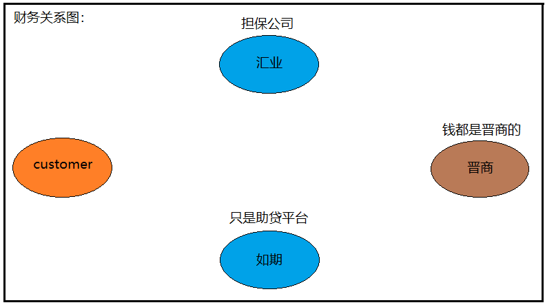

# 财务业务流程：（分为贷前和贷后）

如下图，先理清楚各个节点的意思：




### 提现流程（贷前）：

1. 前置调用财务的 “ IAppPutoutService.apply()  ”提现申请接口，生成额度申请单(app_business_apply)。然后反馈给前置code，msg成功信息和合同信息。

   app_business_putout 提现申请业务数据（提现申请阶段创建）
   app_putout_contract 提现合同信息表（提现申请阶段创建）

   

2. 前置调用完提现申请接口，再调用财务的 “ IAppPutoutService.approve()  ”提现审批接口，生成如期放款表和如期还款计划表，（ app_acct_loan，acct_payment_schedule )。然后向  “支付提现” 反馈报盘成功信息。

   

3. 前置通过from项目（另一个项目）走到晋商，放款成功。调用财务的 “IMerchantsLoanAPIService.

   getMerchantsLoanResult()” 接口通知财务。生成晋商放款表(jin_merchants_acct_loan)。然后同步晋商还款計劃，生成晋商还款计划表(jin_merchants_payment_schedule) 。随之也同步如期还款计划表。

4. 然后放款结果推送到前置，生成“推送前置系统记录表”（cts_send_record），推送到贷后，生成“推送贷后系统记录表”（cts_send_ermas_record）。

   以上都是异步返回数据。					 

```java
app_business_apply（額度申請單）

app_acct_loan（如期放款表）

acct_payment_schedule（如期還款計劃） 本金、利息、滯納金（逾期後會計算）、違約金（提前結清）

jin_merchants_acct_loan（晉商放款表）

jin_merchants_payment_schedule（晉商還款計劃）
```

​														  

### 还款流程（贷后）：

1.   客户还款，前置调用财务的 “IRepaymentService.amountCalculation()  ”还款试算接口。会判断用户是否代偿（1.代偿 2.没有代偿 3.部分代偿）。没有代偿会走“晋商试算”，有代偿会走“如期试算 ”。

```java
一位客户的还款状态：
      第1期  逾期 30+10 天   （20天代偿）
      第2期  逾期 10    天
      第3期  这位客户现在是处在第3期的范围内.  

1. 在第1期，逾期20天的时候，进行代偿，汇业会打钱给晋商。以20天为代偿期。不是系统发起的，是晋商自动扣除的，除非汇业没钱了。   
2. 20天之前走的是晋商的罚息，20天之后就是走如期试算了。
3. 当第3期到了还款日，顾客想还钱了。就不支持一期一期还了，逾期的要全部结清。结清的钱一进来，就要做判断了。因为有代偿和系统不支持一笔钱去两个地方，所以要判断先还给汇业，还是先给晋商。
```


2. 前置调用完试算接口，再调用执行还款接口 “IRepaymentService.stageRepay （） ”，会去判断是否代偿，是否提前结清，判断发起方是谁，判断还款类型状态。会生成如下四张表，报盘给支付。

```java
					发起方:
                          1-财务系统发起
                          2-客户主动发起
                          3-贷后系统发起

					还款类型:
						1-提前还款  （注意：提前还款，如期還款計劃不做更新，到还款日才会同步更新。）
						2-结清还款
						3-逾期还款
						4-正常还款
```

payment_info_offer  提现报盘数据 (报盘表，记录发给支付的数据)

payment_info_status 支付清单状态表(报盘状态表)

repay_log(还款日志，期数)

cts_repay_launch_record(还款执行表，记录还款方式)


3.   还款时财务走到支付，支付通过from项目到晋商，再划扣。支付更新状态，回盘给财务，会调用财务的 “CtsTransferServiceImpl.counteroffer() ” 接口，把信息回盘给财务。更新如下两张表。

payment_info_counteroffer(回盘记录信息)
payment_info_status(报盘状态表，更新)


汇信线下还款
1.汇款申请
2.审核
3.审核通过后，平账

晋商线下还款

cts_report_servfee_settl  同步晋商还款数据

acct_overdue_money(AcctOverdueMoney) 逾期还款明细表


-- 晉商還款文件，每天定時同步晉商，今天同步昨天的數據，所以會有延遲
SELECT * FROM cts_report_servfee_settl WHERE tradeId = '529463183274749201055';

-- 發給前置的數據，包括提現，還款計劃等等
SELECT * FROM cts_send_record WHERE tradeId = '6824295696750595351032';

-- 發給貸後的數據
SELECT * FROM cts_send_ermas_record WHERE tradeId = '529463183274749201055' ORDER BY createTime DESC;

Repay Q:
1.还款报盘后未回盘
2.结清后，无还款时间，未推送给前置
3.线下还款未平账


