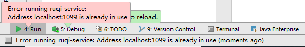
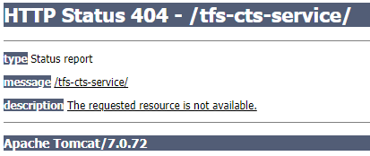

#### bug收集三个地方有，md文件有，google浏览器上有，笔记本上也有。

```java
INFO  com.xxl.job.core.thread.ExecutorRegistryThread Executor registry Executor registry successsuccess,RegistryParam:RegistryParam{registGroup='EXECUTOR',registryKey='job-executor-ruqi-			
```

1. 解决： tomcat配置里的Deployment里配置一下路径。/，斜杠是自动生成的，还要后面加路径。 也要点击红色“+”号，部署Maven项目到Tomcat.（Maven自带有Tomcat的插件.但是版本较低,是6的版本.所以还是用我们自己的Tomcat.配置好之后点击开启Tomcat.启动会慢一点,因为要经过Maven的编译和部署,再执行.）

   



2. 解决： tomcat配置里的server里修改一下端口号，或者调出任务管理器把java进程都关掉！

```
手机如期App人脸识别一直显示网络异常。
```


3.解决：调整一下 server_ip 地址为：172.16.203.17.。这是文件服务器的地址，因为找不到那台服务器！


​        NoClassDefFoundError错误的发生，是因为Java虚拟机在编译时能找到合适的类，而在运行时不能找到合适的类导致的错误。例如在运行时我们想调用某个类的方法或者访问这个类的静态成员的时候，发现这个类不可用，此时Java虚拟机就会抛出NoClassDefFoundError错误。与ClassNotFoundException的不同在于，这个错误发生只在运行时需要加载对应的类不成功，而不是编译时发生。很多Java开发者很容易在这里把这两个错误搞混。

```java
java.lang.NoClassDefFoundError
```


4.解决：maven仓库有些jar包没更新。从下图中 的路径里找到jar包放的位置，然后把jar包删掉。点击maven的刷新按钮，再运行即可。


5. 下图路径有个感叹号，表示StringUtils.class这个文件在 "tfs-base-1.0.1.jar" 这个jar包里。是被其它公司发布着的。我们无法去编辑它。。只能调用它。


6. 

```java
dubbo的com.alibaba.dubbo.rpc.RpcException: Forbid consumer错误（禁止消费者访问）
```

解：用maven命令，重新clean和compile编译。再运行即可！


7.  java.net.SocketException "socket closed"。


解： 右键 任务栏 ---- 查看任务管理器 ----  把java进程都关闭。


8. The requested resource is not available.错误解决方法

报错背景：在Tomcat启动的过程当中，在后台运行正常，看不出任何的问题，但是web界面，却显示这样的错误：



解： 初步认定为web界面没有启动起来。这次启动web之后解决了。


9.  org.springframework.beans.factory.BeanDefinitionStoreException

   java.lang.IllegalArgumentException: Could not resolve placeholder 'mongodb.face.connectionsPerHost' in string value "${mongodb.face.connectionsPerHost}"

报错背景：测试环境切换到开发dev就会报这个错。

解：设置成测试1环境即可解决！