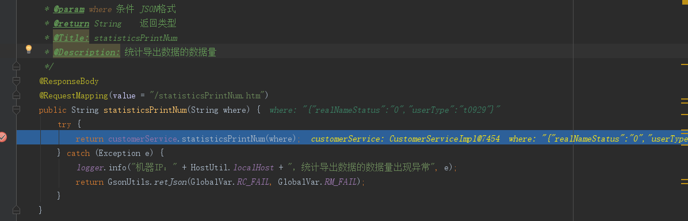
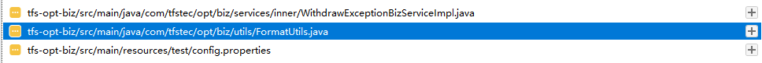
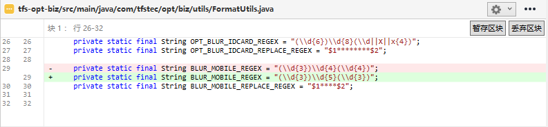
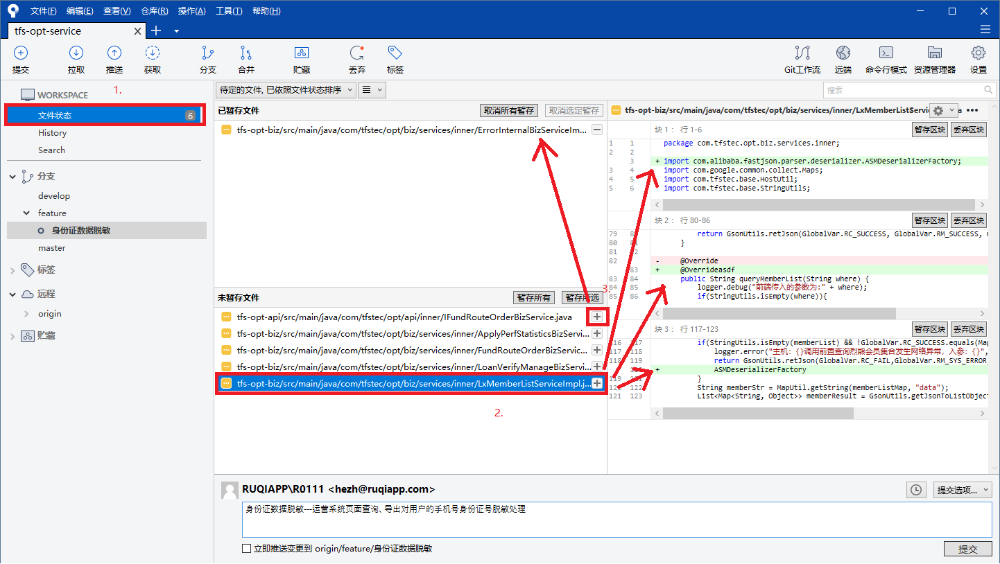
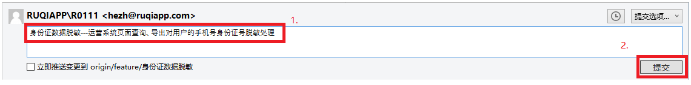

##### 1.脱敏需求

```java
//获得客户查询的列表数据。手机号显示“前三位+****+后三位”，身份证显示“前6位+*******+后四位”,注意key键值名字要一样。
List<Map<String, Object>> customerList = (List<Map<String, Object>>) customerMap.get("data");

//1.先遍历list集合。
for (int i = 0;i < customerList.size(); i++ ){
    //2.获取第一个Map集合，根据键值获取第一个Map集合里的value值。
    //3.再转成String格式。然后调用方法。
    //4.再用变量来接收。
 String cMobile = FormatUtils.blurMobile(String.valueOf(customerList.get(i).get("mobileNo")));
   String cIdCard = FormatUtils.optBlurIdCardNo
                             (String.valueOf(customerList.get(i).get("IdCardNo")));
    //5.把返回结果放回第一个Map里。
   customerList.get(i).put("mobileNo",cMobile);
   customerList.get(i).put("IdCardNo",cIdCard);
}
```

```java
//1.遍历list<map>集合，直接写map并开始循环第一个Map，不用考虑list。
for (Map<String, Object> customer:customerList) {
    //2.从第一个Map里用MapUtil.getString（）方法，直接获取value值。调用方法。然后直接用 map接收。一步到位。
   customer.put("mobileNo", FormatUtils.blurMobile(MapUtil.getString(customer, "mobileNo")));
   customer.put("IdCardNo", FormatUtils.optBlurIdCardNo(MapUtil.getString(customer, "IdCardNo")));
}
```
##### 2.找“导出”功能接口的方法。

疑问： 一按导出直接就跳转到excel的保存窗口界面。F12也没有显示任何东西，如何找到”导出“功能按钮的接口？

答：      比如在opt-web项目里 先找出 “客户查询” 的查询接口。然后往下滑代码就可以看到导出功能的接口（统计导出数据的数据量。）因为查询和导出接口一般都是在一起的！

验证：  可以如下图打个断点，再点击浏览器中的 “导出” 功能按钮。发现在这停住了，说明接口找对了！



##### 3.各页面“导出”字段中若存在手机号或身份号时，均按加密方式进行导出。 。

导出功能的接口是按照上面所说方法找到了。但是脱敏的代码不是写在上面的接口里。而是写在这接口往下的一个print的接口方法里。

##### 4.不要去修改别人的底层文件代码。

疑问： 我修改了脱敏底层代码，别人再改回来不就好了吗？ 

答：     如下图，从sourcetree中看到我修改了脱敏方法底层文件的代码。这样不好，因为到时候要在sourcetree里合并分支。修改的底层代码也会合并到最终代码库。这样别人调用原来底层方法的效果就会消失掉，造成不好的后果。所以要重新去复制粘贴一份自己的方法。




##### 5.需求完成，如何用SourceTree如何提交？

第一步：先执行maven命令（clean—>deploy）一遍。看看有没有报错。

第二步：在SourceTree中，点击文件状态。一行一行地点击这些修改过的类名，再次确认自己修改的代码和配置文件。如下图。看完一行就点击右边的 “+” 按钮，那个文件就会跑到上面去自动暂存起来。



第三步：如下图，在下面的提交信息栏里写上信息。比如“身份证数据脱敏--.......”，前面固定是分支名称，这样别人一眼就知道你这是哪个分支了。点击 “提交”。



第四步：先点击菜单栏的拉取，也许也有人在提交。。再点击推送。。。完成！


