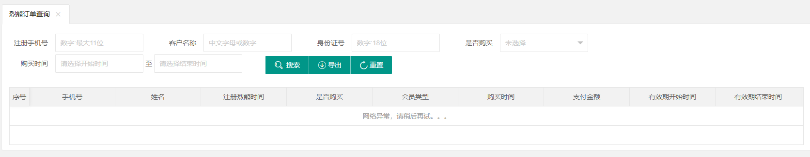
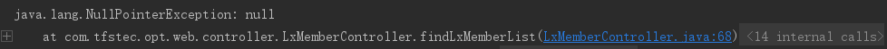
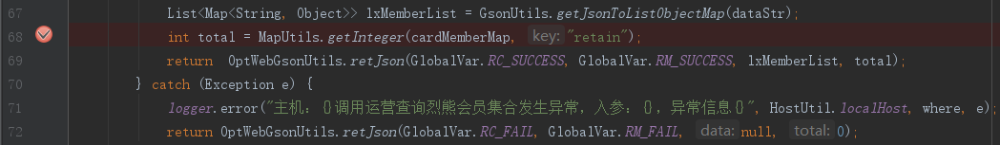

##### 1.解： 转化成Json格式，再用RSA加密！

```java
return RSAForCommunication.retJson(re);
```

##### 2.解： GsonUtils工具包里的一个方法，转成Json格式。

```java
GsonUtils.retJson(）；
//（JSON：JavaScript Object Notation，JS对象标记法，是一种轻量级的数据传输格式，用来代替XML的。json的创建和解析都非常方便，应用的非常普遍。）
```

##### 3.map转成json字符串的方法：

```java
//在opt-service中。（json字符串用String格式接收，这里是传输到另一个平台用。）
String memberList = lieXiongServiceExt.queryLxMemberList(GsonUtils.toJson(map), page, rows);
     ....
  //在ruqi-service中，进入 queryLxMemberList 方法内，参数是上面的json字符串：
    public String queryLxMemberList(String conditionsJson, int page, int rows) {
         ...
     //把json字符串参数转成Map格式的方法。这里是接受到的参数转成Map用。
       Map<String, Object> conditions = GsonUtils.getJsonToObjectMap(conditionsJson);
  }
```

##### 4.查询数据返回值是json字符串 list，list转成map，再转成json字符串list：

```java
//1.返回数据是json字符串    
    String memberListStr = lieXiongServiceExt.queryLxMemberList(GsonUtils.toJson(map), page, rows);
     ......
    //2.json字符串转成map，做脱敏。     
    List<Map<String, String>> memberList = GsonUtils.getJsonToListMap(memberListStr);
    for (Map<String, String> member:memberList) {
            member.put("mobile", FormatUtils.blurMobile(MapUtil.getString(member, "mobile")));
        }
   //3.再转成list格式，返回。
    return GsonUtils.toJson(memberList);
}
```
##### 4.1 获取了data，却没了code和msg，retain。直接在return添加就好了。

##### 学会用浏览器的json转换工具，查看json的内容。

##### 学会转换为map格式的几个不同方法。

##### 学会return返回值里的几个不同方法。

```java
//1.在tfs-opt-service 模块下，返回了“烈熊会员”数据，用json字符串格式接收。里面主要分为三部分：code（状态码）、msg（状态信息）、data（数据）、retain（提取记录总行数）。查询是否返回这些数据可去它的实现方法的 return 返回参数里查看。
     String memberListStr = lieXiongServiceExt.queryLxMemberList(GsonUtils.toJson(map), page, rows);
//2.把返回的json字符串数据转成map格式。可用“GsonUtils.getJsonToObjectMap(）”方法。注意跟“GsonUtils.getJsonToListObjectMap（）”方法区别。因为“memberListStr” 变量里有多个数据。所以用第一个方法。（查看Json数据的方法，可以在debug模式下，右键控制台，选择copy value复制值。再打开浏览器搜索“JSON在线解析及格式化验证”书签。就可查看转换后json的value值。这样让开发者一目了然，好决定用哪个json转换方法。）
Map<String, Object> memberListMap = GsonUtils.getJsonToObjectMap(memberListStr);
.......
//3.转成map格式后，用“MapUtil.getString（）”方法把“data”数据获取出来。是json字符串格式。
String membersStr = MapUtil.getString(memberListMap, "data");
//4.转成map格式。因为变量里只有一个“data”数据，所以可以用“GsonUtils.getJsonToListObjectMap（）”方法。
List<Map<String, Object>> memberList = GsonUtils.getJsonToListObjectMap(membersStr);
//脱敏
for (Map<String, Object> member:memberList) {
    member.put("mobile", FormatUtils.blurMobile(MapUtil.getString(member, "mobile")));
}
//5.做测试的时候，发现网页数据没出来，显示“网络异常”。如下图，opt-web模块控制台也报出Nullpoint空指针错误。debug测试的时候控制台会指出哪一行代码出了问题，点击它直接跳转到该行代码。发现这行代码会获取retain的值，却是null空的。于是回到opt-service模块中，就要加上获取“retain”值的代码。然后返回给web才对！
Integer total = MapUtil.getInteger(memberListMap, "retain");
//6.同理，我们只顾着获取“data”的值做脱敏。code，msg，的值咋办？在return返回值参数里强行加上这些值就行了。最后“GsonUtils.retJson（）”转换Json格式方法里有一个是加上retain参数的，一个是不加上retain参数的。要根据情况用好，看返回值里需不需要而定。
return GsonUtils.retJson(GlobalVar.RC_SUCCESS, GlobalVar.RM_SUCCESS, memberList, total);
```

浏览器：



控制台：






##### 


